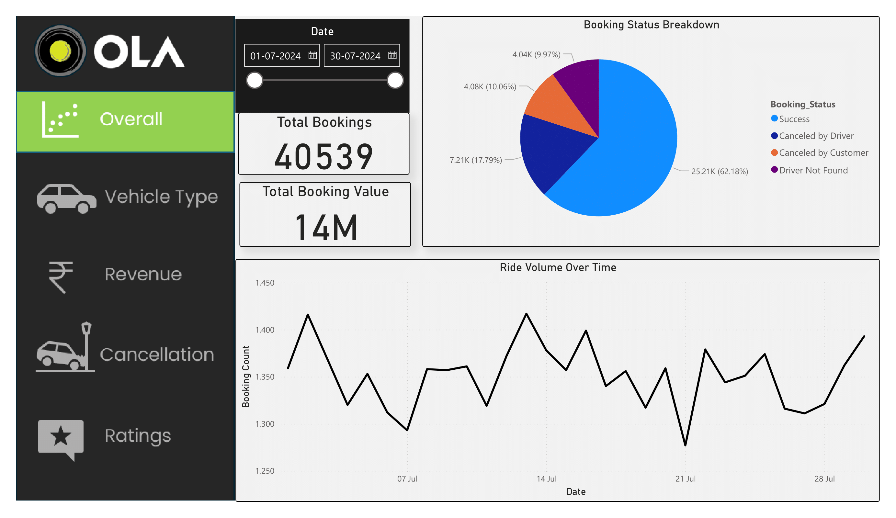
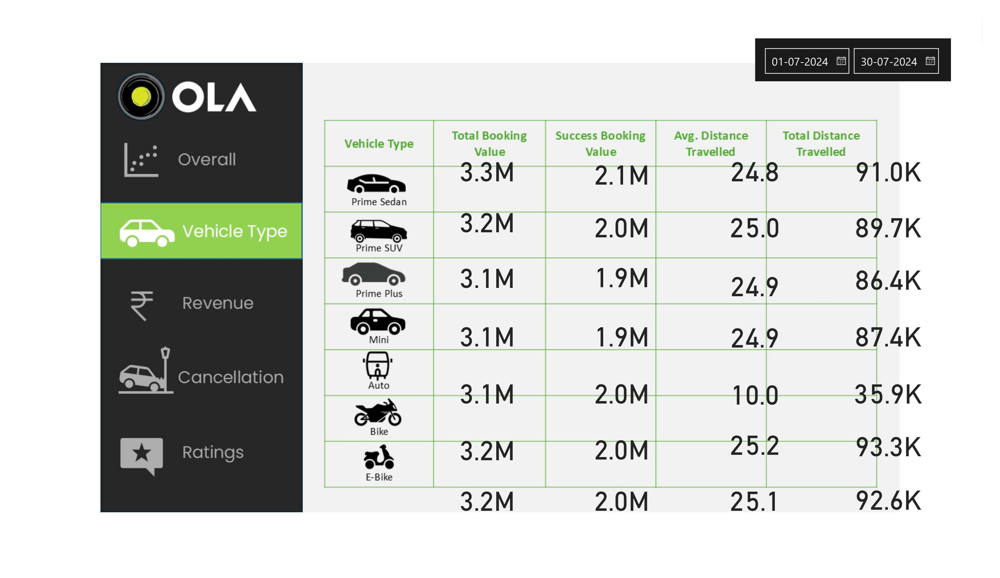
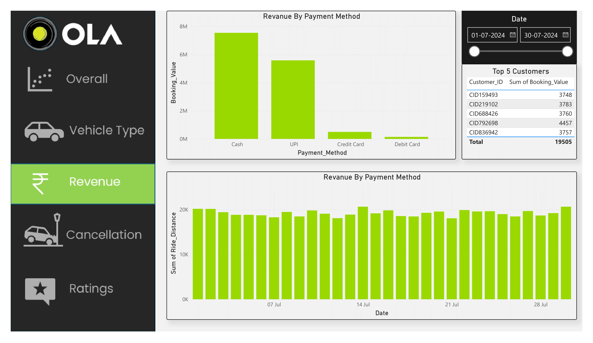
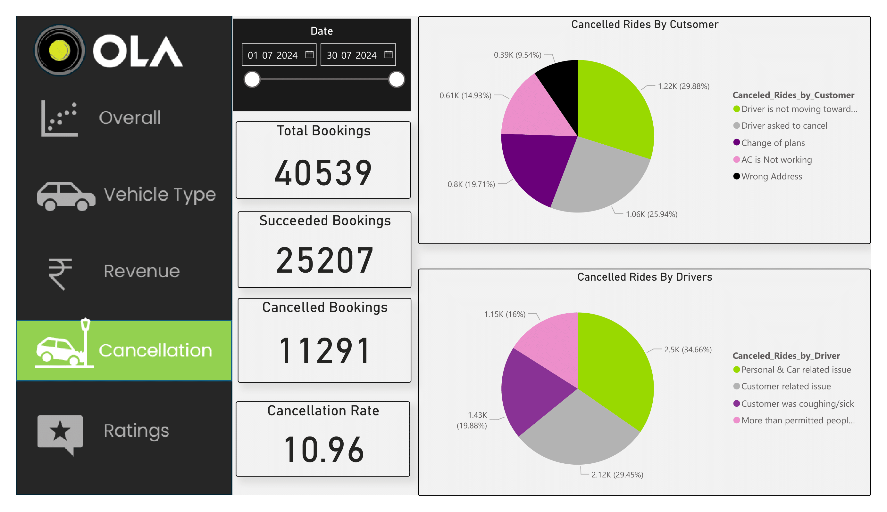
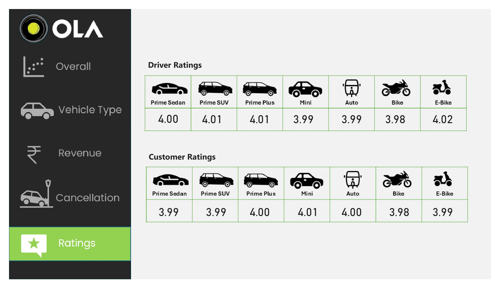

# 🚗 Ola Data Analysis Project

A comprehensive data analytics project using **SQL** for data extraction and transformation, and **Power BI** for visualization and reporting.  
The project focuses on analyzing Ola’s ride data to uncover patterns in customer behavior, revenue performance, and driver efficiency.

---

## 📛 Project Badges  

---

## 📌 Project Overview  
This project demonstrates a full-cycle analytics workflow — from **data extraction using SQL** to **interactive dashboard creation in Power BI**.  
It focuses on understanding ride demand, customer and driver trends, and revenue contribution across different cities.

The goal is to enable business teams to make informed decisions on:
- Pricing optimization  
- Demand forecasting  
- Driver performance management  
- Marketing and city-level expansion  

---

## 📂 Files in This Repository
- `01_Ola_Data_Analysis_SQL.sql` – Contains SQL queries for data cleaning, transformation, and aggregation.  
- `02_Ola_Data_Analysis_DashBoard.pbix` – Power BI dashboard visualizing ride and revenue insights.  
- `README.md` – Project documentation (this file).  

---

## 📊 Dataset Description  
- **File Type:** CSV  
- **Database Used:** SQL Server Express  
- **Data Model:** Ride-level transaction data combined with customer, driver, and city dimensions.  

| Column | Description |
|--------|--------------|
| Booking_ID | Unique ID for each ride |
| Customer_ID | Unique customer identifier |
| Driver_ID | Unique driver identifier |
| Booking_Date | Date and time of booking |
| City | Location of ride |
| Distance_km | Total ride distance |
| Fare_Amount | Amount charged for ride |
| Payment_Method | Payment mode (Cash, UPI, Card, Wallet) |
| Ride_Status | Completed or Cancelled |
| Driver_Rating | Rating given by customer |

---

## 🧮 SQL Analysis Summary  
SQL scripts are used to:
- Clean and validate ride-level data  
- Handle missing or invalid records  
- Aggregate rides and revenue across time and geography  
- Identify high-performing cities, customers, and drivers  
- Build reporting tables for Power BI  

**Key SQL concepts used:**  
CTEs, Window Functions (`SUM() OVER()`, `ROW_NUMBER()`), Conditional Aggregation (`CASE`), Joins, and Date Functions.

**Example Analyses:**  
- Total revenue and completed rides per city  
- Average fare per kilometer  
- Peak booking hours and demand patterns  
- Cancellation rate by city  
- Top-performing drivers by revenue  

---

## 📈 Power BI Dashboard Overview  
The Power BI dashboard built on top of SQL outputs highlights:

### 🔹 KPI Metrics  
- Total Rides  
- Total Revenue  
- Average Fare  
- Active Drivers  

### 🔹 Visual Insights  
- Rides over time (trend analysis)  
- Revenue distribution by city  
- Payment method usage pattern  
- Driver rating performance  

The dashboard provides an interactive interface for management to drill down by city, date, or payment method.

---

## 🖼️ Power BI Dashboard Visuals  

### 1️⃣ Overall Performance Dashboard  

### 2️⃣ Revenue by City  

### 3️⃣ Rides Over Time  

### 4️⃣ Payment Method Usage  

### 5️⃣ Driver Ratings Distribution  

---

## 📍 Key Insights
- **High Demand:** Evening rides (6 PM – 9 PM) contribute most to total trips.  
- **Revenue Leaders:** Metropolitan cities like **Mumbai, Bangalore, and Delhi** generate the majority of revenue.  
- **Preferred Payments:** **UPI and Cards** dominate over cash.  
- **Driver Ratings:** Consistent 4.5+ rating drivers contribute to higher retention.  
- **Customer Behavior:** Frequent riders show higher loyalty in cities with better discount programs.

---

## 💼 Business Recommendations  
- Focus marketing campaigns on **top 3 cities** with the highest customer base.  
- Offer **loyalty rewards** to top riders to boost retention.  
- Implement **driver incentive programs** during high-demand periods.  
- Continue to promote **cashless payments** for faster transactions.  
- Monitor **driver ratings** as a proxy for service quality and customer satisfaction.

---

## ▶️ How to Reproduce / Run

### 1️⃣ Setup SQL Environment
1. Install **SQL Server Express** or use **Azure SQL**.  
2. Create a new database, e.g., `Ola_Analytics`.  
3. Import the CSV files (using SSMS Import Wizard or BULK INSERT).  

### 2️⃣ Run SQL Scripts
Execute the SQL scripts (`01_Ola_Data_Analysis_SQL.sql`) to generate:
- Cleaned datasets  
- Aggregated views for Power BI  

### 3️⃣ Open Power BI Dashboard
1. Open `02_Ola_Data_Analysis_DashBoard.pbix` in Power BI Desktop.  
2. Update the **SQL connection string** to your database.  
3. Refresh visuals to load the latest data.  

---

## 🧾 Best Practices  
- Maintain consistent naming conventions across SQL tables and Power BI data models.  
- Create indexes on key columns (e.g., Booking_Date, City) for performance.  
- Schedule regular data refreshes for the dashboard.  
- Validate currency and distance conversions before aggregating.  

---

## 🏁 Conclusion  
This project integrates **data engineering, SQL analytics, and Power BI visualization** to deliver actionable insights for business teams.  
It highlights how data-driven analysis can optimize ride allocation, improve driver efficiency, and enhance customer experience for a ride-hailing platform like Ola.

---
